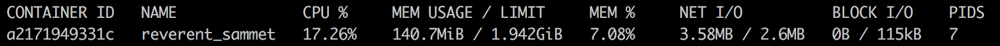

# Technical Challenge - Read Only Key/Value Store
The task is to build a read-only key value server that a client is able to contact over network with a query containing a key and the server returns a corresponding value, as defined in the example dataset. 

The keys must be valid UUID (version 4) and the values are strings.

The server is built with [FastAPI](https://fastapi.tiangolo.com/). The code can be found in `main.py`. 

**Example requests are shown under the Launch Server section. **

## Launch server
### Locally 
To run in your local environment, make sure you have python>=3.7 installed, install the requirements (`pip install -r requirements.txt` in this directory), then run the following command start the web server:conda create -n

```bash 
uvicorn main:app --host 0.0.0.0 --port 8080
```

### Docker 
Alternatively, this server lives on dockerhub. You can skip the requirements install and run the server on this image with the following commands: 
```bash
docker pull registry.hub.docker.com/nicktorba/app:0.1
docker run -p 8080:8080 registry.hub.docker.com/nicktorba/app:0.1 uvicorn main:app --host 0.0.0.0 --port 8080
```

## Make Request 
When a successful request is made, the server returns a payload like the following
```python
{'value': 'lunmtp ftxemjfob pmo hwoya'}
```
where the corresponding value is the value matching the key sent with the original request.

When the server receives a request but the key is invalid or not found in the db, it returns a payload like the following: 
```python
{'message': 'information about why the request failed'}
```

Make a request with python:
```python 
import requests

res = requests.post(
    "http://localhost:8080/get_value",
    json={"key": "8a35eb59-62b3-481c-8875-1f248df4c952"},
    verify=False,
)
print(res)
print(res.json())
```

Make a request with `curl`: 
```bash 
curl http://localhost:8080/get_value -d '{"key":"8a35eb59-62b3-481c-8875-1f248df4c952"}' -X POST -H 'Content-Type: application/json'
```

### Tests
The small tests suite was created with pytest. You'll need both the requests and pytest packages to run these tests (along with the requirements in the requirements.txt foler).
You can run the suite with the `pytest` command. 

## Dev Environment
Last week I stumbled into [devspace](https://devspace.sh/cli/docs/quickstart) which is an awesome project. I had just been experimenting with building my own version (detailed in this [series of quoted tweets](https://twitter.com/nicktorba/status/1451569315686359044?s=20)). 

So I used it for the dev of this challenge (you don't need to, I just thought it was a cool note and explains all the extra files in this project). 

## Dev Notes
* only 10k k/v pairs in data
    * using sys.getsizeof, the data is `295016` bytes in memory 
    * the server could handle much more data before needing to do any fancy tricks

### Loadtest
To get a quick idea about latency I used a basic locust loadtest to run against the service.

There is a locust file you can use to run a quick loadtest. For now, it is only set up to run locally. 

```bash
pip install locust==2.4.1
```

With the endpoint running in another window, run the following to open the loadtest
```bash  
locust -f locustfile.py 
```

My laptop started to falter pretty quickly when generating high amounts of load. This load test could be quickly adapted to run on kubernetes with the [locust helm chart](https://github.com/locustio/helm-chart). 


## Resources
While the load test was consistently generating 100 req/s (the highest volume my laptop seems to be able to handle atm), kept an eye on the output of `docker stats` to get a rough idea of resource usage. An image of the output is shown below:



The CPU % fluctuated between 15-30%. The CPU limit was set at 1 core. 

